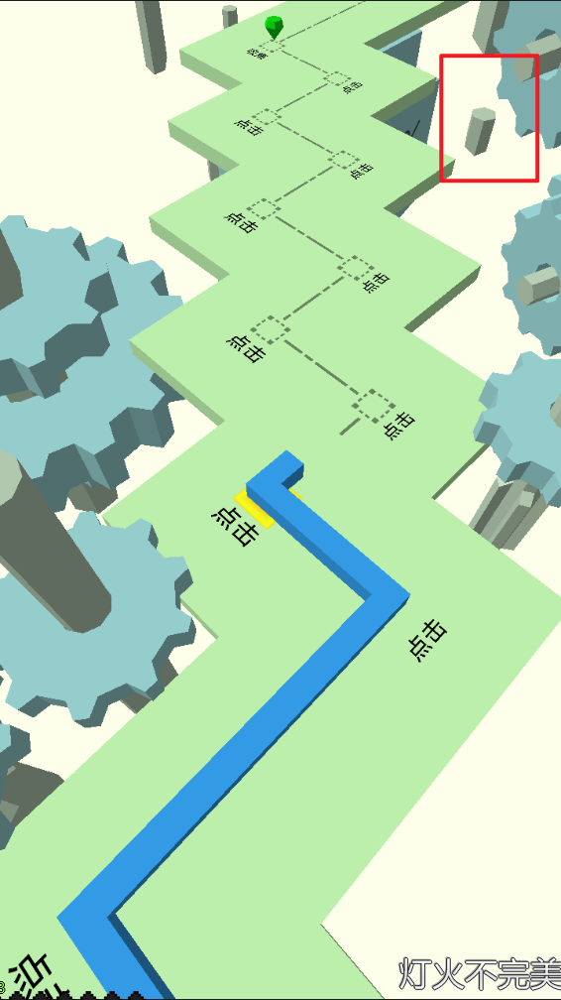
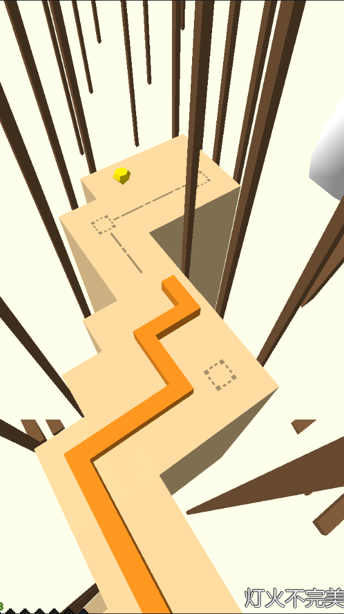

# Assembly-CSharp.dll 的研究

可以在 Hero 类中进行修改，此类被绑定到线上  

## 去雾
在 Hero 类的 Start 方法中加上：  
```cs
RenderSettings.fog = false; //关闭雾气
Camera.main.farClipPlane = 1000; //Unity 默认值
```
其中，`farClipPlane` 是相机的最远渲染距离，如果不改，就会出现下面这种情况  
估计官方是为了减轻性能占用
  



