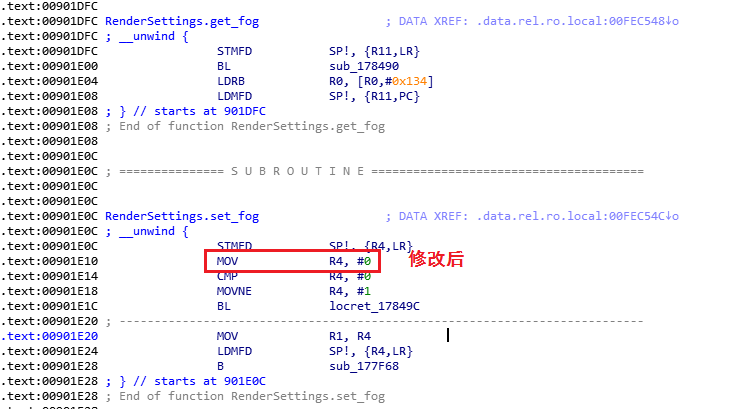

# 对 libunity.so 的研究

## 如何应用修改
打开 IDA，Edit->Patch program->Change byte...，复制所有字节  
打开[这个网站](http://armconverter.com/hextoarm)，选择`ARMv7 ARM`，将复制到的字节转换为 ARM 汇编码  
修改之后，再在[这里](http://armconverter.com/)，选择` x32/x64 - ARM32 & ARM64 Converter - New`，转换为字节码  
用十六进制编辑器打开文件，转到与 IDA 相同位置，将转换后的字节码与原来的对比，在编辑器里修改，保存即可  

## 各函数位置
**PS: 用 IDA 打开文件，搜索下列位置**  

RenderSettings.get_fog:  
```
00 48 2D E9 A2 D9 E1 EB 34 01 D0 E5 00 88 BD E8
```

RenderSettings.set_fog:  
```
00 40 A0 E1 00 00 54 E3 01 40 00 13 9B D9 E1 EB
```

**TODO: 搞明白怎样修改此函数**
UnityEngine.Camera::set_farClipPlane:
```

```

## 去雾
用十六进制编辑器打开 `libunity.so`  

set_fog(去雾):  
搜索 `00 40 A0 E1 00 00 54 E3 01 40 00 13 9B D9 E1 EB`  
修改为 `00 40 A0 E3 00 00 54 E3 01 40 00 13 9B D9 E1 EB`  

(设置相机最远渲染距离):

### 原理
RenderSettings.set_fog 中原来的代码（一部分）是：
```cpp
MOV	R4, R0
CMP	R4, #0
MOVWNE	R4, #1
BL	#0xFF876680
```

修改后：  
```cpp
MOV	R4, #0
CMP	R4, #0
MOVWNE	R4, #1
BL	#0xFF876680
```

其中 `R4` 是传进来的参数，`0` 为 false，`1` 为 true  
修改之后，不管参数是什么都会变为 false  
